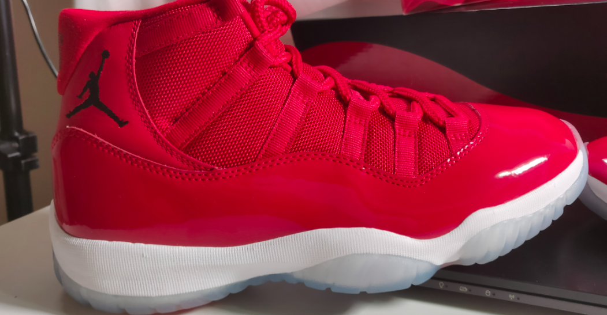
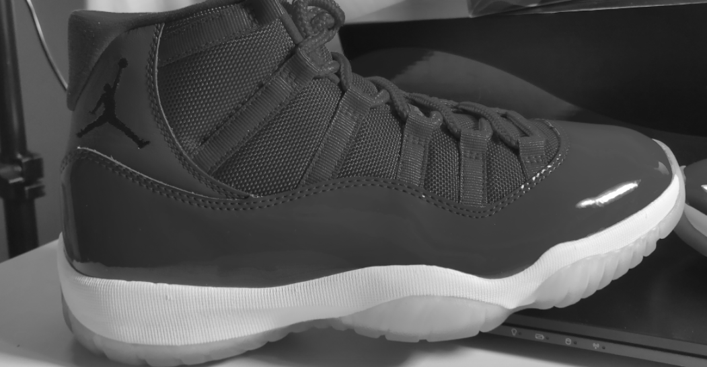
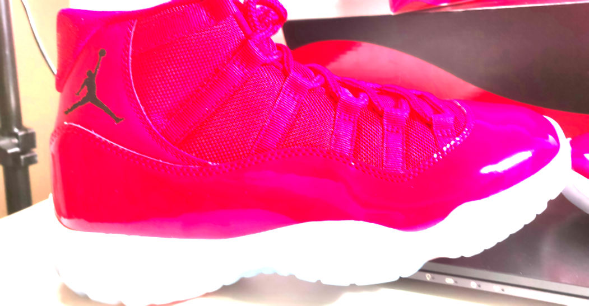
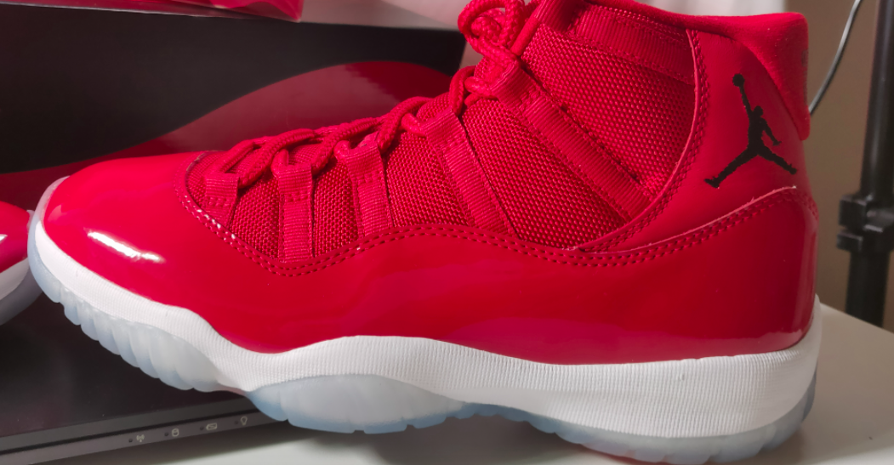
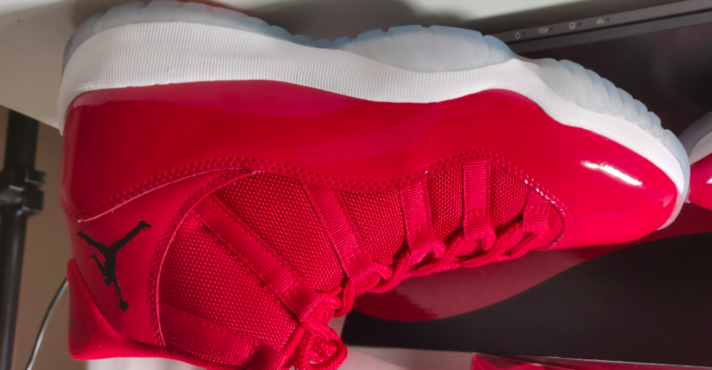

## Training Output

~~~python
+------------------+--------------+------------------+
| Images Processed | Elapsed Time | Percent Complete |
+------------------+--------------+------------------+
| 63               | 5.82s        | 100%             |
+------------------+--------------+------------------+
Logistic regression:
--------------------------------------------------------
Number of examples          : 63
Number of classes           : 4
Number of feature columns   : 1
Number of unpacked features : 2048
Number of coefficients      : 6147
Starting L-BFGS
--------------------------------------------------------
+-----------+----------+-----------+--------------+-------------------+
| Iteration | Passes   | Step size | Elapsed Time | Training Accuracy |
+-----------+----------+-----------+--------------+-------------------+
| 0         | 5        | 0.039852  | 0.214507     | 0.301587          |
| 1         | 9        | 0.836884  | 0.384588     | 0.507937          |
| 2         | 10       | 1.000000  | 0.473797     | 0.920635          |
| 3         | 11       | 1.000000  | 0.546340     | 0.968254          |
| 4         | 12       | 1.000000  | 0.615277     | 1.000000          |
| 9         | 18       | 1.000000  | 0.973880     | 1.000000          |
+-----------+----------+-----------+--------------+-------------------+
Analyzing and extracting image features.
+------------------+--------------+------------------+
| Images Processed | Elapsed Time | Percent Complete |
+------------------+--------------+------------------+
| 21               | 1.96s        | 100%             |
+------------------+--------------+------------------+

Test Accuracy:
0.7619047619047619

~~~

 
## Data Pipeline
The images I have come from reddit and stockx. I have data for jordan `one, three, four, eleven` (these are models of jordans). I took a screenshot of each shoe at different angles. I have about an average of 150 for each jordan. Some are higher quality while some are blurry, some are being worn, some are just shoes, some have 2 shoes in one photo, different angles (ie. back, front, left, right), etc. I also have a dataset with all the same images but with a filter applied to them in `filteredDataset` which I then created a model using those images to see if this would get me better results. All classes have 150 images, some 160. Here are some examples of the images I have.
 

 
I knew I needed to increase my amount of data so I created a file called 'addFilterToImages.py'. In this file I run all all the images in the folder `dataset` through a function that applies a filters to them. Each photo would get 5 filters applied to them (flipped vertically, flipped horizontally, black and white, saturated, blurred). Once I did this I ended up with about 900 images for each class. Here are some examples:
 

 
 
I then tried to run my model again and see if test accuracy would change but there was little to know change. My model was performing best when my classes were slightly disbalanced. This could mean my model was predicting a certain class more often because of my dataset and there for getting high test accuracy. I can try and prove this by creating a model with a very disbalanced dataset and see how that turns out.
 
 
I created a model using turi create with images that I also found and took myself. A pipeline that would be good to have would be to have a brand identification then once we identify the brand we can send it to another model that specifies a shoe number. When testing out my models with images I took of my own shoes the most common mistake that would happen is labeling any shoe as a `jordan_eleven`
 
 
## Evaluating
I tested my model with images I took of my own shoes. Overall it predicted the shoe well. One thing I did realize is that it's more likely to predict a shoe over another. The predictions can be seen in `modelEval.ipynb`

~~~python 

Logistic regression:
--------------------------------------------------------
Number of examples          : 2835
Number of classes           : 4
Number of feature columns   : 1
Number of unpacked features : 2048
Number of coefficients      : 6147
Starting L-BFGS
--------------------------------------------------------
+-----------+----------+-----------+--------------+-------------------+---------------------+
| Iteration | Passes   | Step size | Elapsed Time | Training Accuracy | Validation Accuracy |
+-----------+----------+-----------+--------------+-------------------+---------------------+
| 0         | 5        | 0.105322  | 0.910528     | 0.456790          | 0.440000            |
| 1         | 9        | 2.211769  | 1.802593     | 0.557319          | 0.480000            |
| 2         | 14       | 1.770433  | 2.860240     | 0.600705          | 0.540000            |
| 3         | 15       | 1.770433  | 3.257373     | 0.681129          | 0.606667            |
| 4         | 21       | 0.536856  | 4.520679     | 0.738977          | 0.686667            |
| 9         | 28       | 1.000000  | 6.896338     | 0.832099          | 0.746667            |
+-----------+----------+-----------+--------------+-------------------+---------------------+
Analyzing and extracting image features.
+------------------+--------------+------------------+
| Images Processed | Elapsed Time | Percent Complete |
+------------------+--------------+------------------+
| 64               | 6.55s        | 7.5%             |
| 128              | 13.39s       | 15.25%           |
| 192              | 20.14s       | 23%              |
| 256              | 26.98s       | 30.75%           |
| 320              | 33.49s       | 38.25%           |
| 448              | 47.16s       | 53.75%           |
| 512              | 53.61s       | 61.5%            |
| 576              | 1m 0s        | 69%              |
| 640              | 1m 7s        | 76.75%           |
| 704              | 1m 13s       | 84.5%            |
| 768              | 1m 20s       | 92.25%           |
| 771              | 1m 20s       | 100%             |
+------------------+--------------+------------------+
Test Accuracy:
0.7600518806744487
~~~